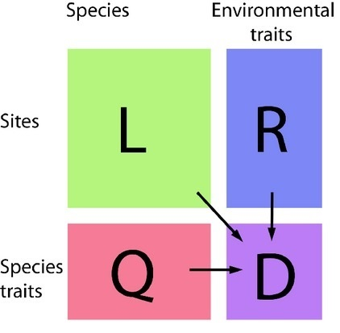
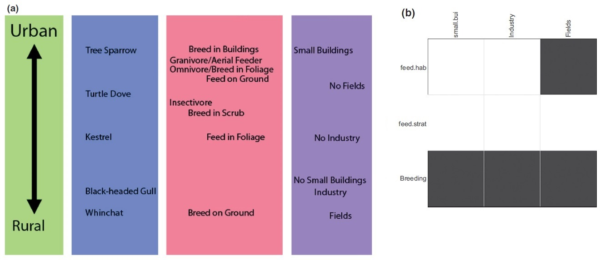

<!--Begin setup-->

```{=html}
<style type="text/css">
body, td {font-size: 16px}
code.r {font-size: 16px}
pre {font-size: 16px}
body {text-align: justify}
h1 {font-size: 30px}
h2 {font-size: 26px}
h3 {font-size: 24px}
h4 {font-size: 20px}
img {display: block; margin: 0 auto;}
</style>
```

```{=html}
<script type="text/x-mathjax-config">
MathJax.Hub.Config({TeX: {equationNumbers: {autoNumber: "AMS"}}});
</script>
```

```{r xaringanExtra-clipboard, echo=FALSE, include=FALSE}
#copy to clipboard button
htmltools::tagList(
  xaringanExtra::use_clipboard(
    button_text = "<i class=\"fa fa-clipboard\"></i>",
    success_text = "<i class=\"fa fa-check\" style=\"color: #90BE6D\"></i>",
  ), rmarkdown::html_dependency_font_awesome()
)
```

```{r setup, include=FALSE}
knitr::opts_chunk$set(echo = TRUE, warning = FALSE, message = FALSE)
```

<!--End setup-->

------------------------------------------------------------------------

# PARTE 1 --- Introducción

------------------------------------------------------------------------

## Cuarta esquina o *fourth-corner*

El problema de la cuarta esquina (*fourth-corner*) trata de relacionar los rasgos de los organismos con el entorno en el que estos se encuentran. Es una aproximación más holística al modelado de distribución de especies, que clásicamente se realiza teniendo en cuenta la relación directa de las especies con el ambiente. ¿Por qué recibe el nombre de la **cuarta esquina**? Se debe a que involucra tres matrices para calcular una cuarta, como vemos en el siguiente esquema:

------------------------------------------------------------------------

<center>



</center>

------------------------------------------------------------------------

-   La matriz *L* contiene información de especies por localidad
-   La matriz *R* contiene información del ambiente de dichas localidades
-   La matriz *Q* contiene información de los rasgos de las especies
-   La matriz *D*, entonces, contendría información de la relación rasgo-ambiente

------------------------------------------------------------------------

Y, ¿por qué decimos que es un **problema**? Esto se debe a que no es nada sencillo calcular dicha matriz. En los últimos 30 años ha habido dos propuestas principales:

-   Análisis *RLQ* [@dolédec1996]: consiste en un enfoque exploratorio que construye ordenaciones conjuntas de variables ambientales y rasgos mediante descomposición de valores singulares, proporcionando una visión cualitativa de asociaciones generales entre rasgos y ambiente (panel **a** de la figura a continuación)
-   Pruebas de hipótesis [@legendre1997]: consiste en un enfoque de álgebra matricial en el que se realizan pruebas de permutación sobre las matrices *R*, *L* y *Q* para determinar una matriz *D* que resume qué asociaciones entre variables ambientales y rasgos son significativas, sin proporcionar detalles sobre la intensidad de estas interacciones (panel **b** de la figura a continuación)

------------------------------------------------------------------------

<center>


</center>

------------------------------------------------------------------------

Aunque ambas soluciones cumplen diferentes propósitos, no proporcionan una solución cuantitativa para la cuarta esquina y, por tanto, no nos permiten entender la magnitud de las interacciones entre rasgos y ambiente. En los pasos siguientes, veremos cómo podemos hacer esto utilizando modelos lineales generalizados con las tres matrices, siguiendo la solución propuesta por @brown2014.


## Proceso de análisis (*workflow*)

### Librerías de R

En primer lugar, cargaremos las librerías de R que vamos a utilizar a lo largo de nuestros análisis. Las **librerías o paquetes** son recopilaciones de funciones, generalmente sobre un temática específica, que nos sirven para realizar procesos en R, como manejo o análisis de datos, de una forma estandarizada y rápida. Aunque estos paquetes suelen estar escritos por personas que se dedican a la programación o a la ciencia, R es una comunidad de software libre, así que cualquier persona que tenga una metodología y quiera compartirla con la comunidad de usuarios de R puede crear su propio paquete. Los paquetes de R pueden instalarse directamente a través del [CRAN](https://cran.r-project.org/) utilizando la función `install_packages()` con el nombre del paquete como argumento de la función, entre comillas (por ejemplo: `install.packages("tidyverse")`). En ocasiones, también pueden instalarse directamente desde las cuentas de [GitHub](https://github.com/) de los usuarios. Los paquetes solo necesitan instalarse una vez en un ordenador (aunque conviene estar informado sobre posibles actualizaciones). Sin embargo, cada vez que iniciamos una nueva sesión de R hemos de cargar esos paquetes. Esto se hace usando la función `library()`, que es la forma de decirle a nuestro programa que queremos utilizar las funciones que el paquete contiene.

A continuación, pues, instalamos las librerías a utilizar:

```{r install_packages, eval=FALSE}
install.packages("tidyverse") # manipulación, transformación y dataviz
install.packages("mvabund") # manupilación y análisis de datos multivariantes
```

Y las cargamos:

```{r load_packages}
# fíjate en que ya no hacen falta las comillas para cargar los paquetes
library(tidyverse)
library(mvabund)
```

```{r load_ggpubr, echo=FALSE}
library(ggpubr)
```


Estos paquetes son:

-   `tidyverse` [@wickham2019], que es en realidad una colección de paquetes de programación funcional que sirven para la manipulación de datos de forma más eficiente, utilizando tuberías (*pipes*) para enlazar elementos. La *pipe* es `%>%`, que veremos mucho en el código en este documento. Aunque parezca poco tostón escribir `%`, `>` y `%`, podéis insertarla automáticamente presionando las teclas `shift + control + m` en Windows (o `shift + command + m` en Mac).

-   `mvabund` [@wang2012], que es un paquete para modelizar datos de abundancia en ecología de comunidades y que contiene las funciones que utilizaremos en el análisis de *fourth-corner*.


### Datos *dummy*

Vamos a crear matrices con datos ficticios (lo que se llama en inglés datos *dummy*) para aprender cómo se utiliza esta técnica. Lo primero que haremos será seleccionar cuántas especies, cuántos rasgos funcionales, cuántas variables ambientales y cuántos sitios o localidades queremos:

```{r number_of_variables}
species <- 20 # número de especies para nuestros datos dummy
sites <- 10 # número de sitios o localidades para nuestros datos dummy
traits <- 15 # número de rasgos funcionales para nuestros datos dummy
env_var <- 15 # número de variables ambientales para nuestros datos dummy
```

```{r seed_options, include=FALSE}
# sembrar una semilla para asegurar la reproducibilidad
seed <- c(5558,  # 1; por defecto
          7120,  # 2; 7, + y -
          9937,  # 3; 16, + y -
          1840,  # 5; 4, solo +
          5647,  # 6; 5, solo -
          216)   # 7; zero
```

Y, a continuación, vamos a sembrar una semilla (*seed*). ¿Qué quiere decir esto? La semilla es un número natural que transforma lo estocástico en determinista. Esto es, al trabajar con funciones que generan datos aleatorios (por ejemplo, `runif(n)`, siendo `n` el número de elementos a generar), si no hemos plantado una semilla, cada vez que corramos la función los resultados generados cambiarán (¡probad a correr `runif(10)` sin semilla varias veces!). Sin embargo, cuando plantamos una semilla usando la función `set.seed()`, el resultado generado será siempre el mismo, y sólo cambiará si cambiamos la semilla. Aquí utilizaremos el número `r seed[1]` como nuestra semilla por defecto.

```{r seed}
set.seed(5558)
```

Finalmente, vamos a crear las matrices necesarias para los análisis. Tenemos en mente que, aunque en este ejercicio estamos generando datos ficticios, en la práctica estas matrices comprenderían datos reales de nuestro sistema de estudio. La cuestión es que estos datos deben estar organizados en las siguientes matrices con la siguiente estructura:


#### Matriz *L*

Matriz de abundancia de especies por localidad (*L*), con `r species` especies en columnas y `r sites` localidades en filas.

```{r dummy_L}
# crear una base de datos de combinaciones de especie y sitio
L <- expand.grid(species = paste0("sp", 1:species),
                 sites = paste0("site", 1:sites))

# añadir una columna con los datos de abundancia
L$value <- rpois(nrow(L), 30)

# incorporar los datos a una matriz
L <- L %>%
  spread(key = species, value = value) %>%
  column_to_rownames(var = "sites") %>%
  as.data.frame()

# observar las primeras filas de dicha matriz
head(L)
```


#### Matriz *Q*

Matriz con datos de rasgos funcionales por especie (*Q*), con `r traits` rasgos en filas y `r species` especies en columnas.

```{r dummy_Q}
# crear una base de datos de combinaciones de rasgos y especies
Q <- expand.grid(species = paste0("sp", 1:species),
                 traits = paste0("t", 1:traits))

# añadir una columna con los datos cuantitativos
Q$value <- round(runif(n = nrow(Q), 0, 1), 3)

# incorporar los datos a una matriz
Q <- Q %>%
  spread(key = species, value = value) %>%
  column_to_rownames(var = "traits") %>%
  as.data.frame()

# observar las primeras filas de dicha matriz
head(Q)
```


#### 2.2. Matriz *R*

Matriz con datos de variables ambientales por localidad (*R*), con `r env_var` variables ambientales y `r sites` localidades.

```{r dummy_R}
# crear una base de datos de comb. de variables ambientales y sitios
R <- expand.grid(environ = paste0("env", 1:env_var),
                 sites = paste0("site", 1:sites))

# Add a column with random quantitative data from 0 to 1
R$value <- round(runif(n = nrow(R), 0, 1), 3)

# incorporar los datos a una matriz
R <- R %>%
  spread(key = environ, value = value) %>%
  column_to_rownames(var = "sites") %>%
  as.data.frame()

# observar las primeras filas de dicha matriz
head(R)
```


### Exploración de los datos

> El objetivo de esta sesión no es aprender R, ni mucho menos dominar la visualización de datos (que requiere mucha práctica), pero sí me gustaría que os lleváseis una idea de que estas herramientas están disponibles y no son tan innaccesibles como pueden parecer.

Lo primero que vamos a hacer es observar cómo es la distribución de la abundancia de organismos en las diferentes poblaciones. Para ello, vamos a utilizar el paquete `ggplot2`, perteneciente al `tidyverse`, del que ya hablamos anteriormente. La función `ggplot()` es una de las más poderosas del lenguaje R para crear visualizaciones de datos. Funciona por capas: primero, `ggplot` crea un espacio o lienzo definido por ciertas variables de una base de datos. Dicho lienzo puede ser completado con la adición de distintas funciones de representación de los datos, como `geom_point()` o `geom_line()` que añaden una nube de puntos o una línea, respectivamente. Asimismo, funciones cómo `theme()` se encargan de cuidar los detalles estéticos del gráfico, como el tamaño de la letra de los rótulos, el color de fondo o la presencia o ausencia de ejes. Para más comodidad, en lugar de añadir la estética para cada gráfico, podemos utilizar la función `theme_set()` para definir una estética global que se aplica a todos los gráficos.

```{r set theme}
# estética general de los plots
theme_set(theme_minimal() +
            theme(axis.title = element_text(size = 15),
                  axis.line = element_line(color = "black", linewidth = 0.5),
                  panel.grid.major = element_blank(), 
                  panel.grid.minor = element_blank(),
                  axis.text = element_text(color = "black", size = 12),
                  strip.text.x = element_text(size = 12),
                  axis.ticks = element_line(color = "black")))
```

```{r explore_dummy2}
# plot de abundancia por sitio
L %>%
  
  # pasamos los nombres de fila a una columna
  rownames_to_column(var = "site") %>% 
  
  # transformamos la matrix para poder hacer el plot
  pivot_longer(cols = -site,
               names_to = "species",
               values_to = "abundance") %>% 
  
  # añadimos el plot
  ggplot(aes(x = abundance,
             y = reorder(species, abundance, FUN = max),
             color = site)) +
  geom_point() + # gráfico de puntos
  labs(x = "Abundancia",
       y = "Organismo",
       color = "Sitio") +
  theme(text = element_text(size = 18))
```


### Aproximaciones a la distribución de especies

Queremos entender cómo se distribuyen los organismos en términos de abundancia. A continuación, vamos a ir construyendo nuestro entendimiento de cómo esto sucede, desde las preguntas y análisis más sencillos.


#### ¿Efecto general del sitio?

Lo primero de todo: hemos muestreado diez localidades en cinco espacios naturales diferentes. ¿Está la abundancia de los diferentes organismos determinada por el lugar de muestreo?

El paquete `mvabund` nos permite ajustar modelos para explicar la abundancia de los organismos. Para esto, es necesaria una pequeña transformación de la estructure de la matriz de datos *L*, que se realiza con la función homónima `mvabund()`, integrada en el paquete. Tras esto, somos capaces de utilizar otra función de `mvabund`, `manyglm()`, para explicar la abundancia de la matriz en función del lugar de muestreo, explícito como `rownames(L)` o, lo que es lo mismo, los nombres de las filas de la matriz *L*. Podemos especificar la distribución de los datos para el modelo utilizando el argumento `family`; en este caso, lo que mejor se ajusta es una distribución poisson, pero podéis probar a cambiar esta distribución (por ejemplo, a `family = "negative_binomial"`) y ver qué ocurre con la distribución de los residuos.

```{r poisson model}
# creamos un objeto 'mvabund' a partir de la abundancia
spp <- mvabund(L)

# hacemos un modelo para explicar la abundancia en función del sitio
mod <- manyglm(spp ~ rownames(L), family = "poisson") # distr. poisson

# representamos los residuos del modelo
plot(mod)
```

Luego, simplemente lo podemos resolver con un análisis de la varianza:

```{r anova1}
# análisis de la varianza para ver si el sitio explica la abundancia
(anov <- anova(mod, nBoot = 999))
```

Como podemos ver, el estadístico nos indica que *p* = `r anov$table[2,4]` \> 0.05 y, por tanto, podemos decir que el sitio no tiene un efecto *significativo* a la hora de explicar las abundancias de los organismos.


#### Explicación a través del ambiente

En segundo lugar, podemos realizar la aproximación más clásica en modelos de distribución de especies: intentar entender qué variables climáticas explican la abundancia de los diferentes organismos. Ciertos modelos más o menos complejos incluso permiten hacer predicciones sobre la distribución potencial de los organismos a través de modelización ambiental.

En nuestro caso, podemos utilizar una función integrada en el paquete `mvabund` llamada `traitglm()`. Esta función aplica modelos lineales generalizados ([GLMs](https://bookdown.org/steve_midway/DAR/glms-generalized-linear-models.html)) para explicar una matriz de datos en función de otra (u otras) matrices de datos de estructura compatible. Por ejemplo, no podremos explicar una matriz de 10x20 en función de una matriz de 5x15, pero sí una de 10x20 en función de una de 10x15.

```{r multivariate SDM}
# explicamos la matriz de abundancia en función del ambiente
sdm_env <- traitglm(L, R) # modelo lineal generalizado (glm)

# transformar y dataviz
sdm_env$fourth.corner %>%
  as_tibble(rownames = "species") %>%
  pivot_longer(cols = -species, names_to = "env_var", values_to = "value") %>% 
  mutate(species = as.factor(str_extract(species, "sp\\d+")),
         value = round(value, 5),
         env_var = forcats::fct_inorder(env_var),
         species = forcats::fct_reorder(species, as.numeric(str_extract(species, "\\d+")))) %>% 

  # mapa de calor
  ggplot(aes(x = env_var, y = fct_rev(species), fill = value)) +
  geom_raster() +
  scale_fill_gradient2(low = "blue", mid = "white", high = "red",
    midpoint = 0) +
  labs(x = "Variables ambientales",
       y = "Especies",
       fill = "Coeficiente") +
  theme(axis.text.x = element_text(angle = 60, hjust = 1, vjust = 1))
```

A pesar de que esta aproximación nos aporta gran información sobre la relación de las especies con su ambiente, no deja de ser una forma de analizar qué ocurre con las especies de forma individual. Esto no nos permite alcanzar el nivel de abstracción que deseamos para resolver a nuestra pregunta; para ello, necesitamos incluir los datos de los rasgos funcionales de las especies.


## Rasgos funcionales y la matriz *fourth-corner*

Esto lo podemos hacer con la misma función, `traitglm()`, pero añadiendo la matriz *Q*. En este caso, necesitamos introducir la transpuesta (`t()`) de *Q* porque sino el modelo no puede computar matrices de diferente tamaño y nos da el siguiente error: `number of rows of matrices must match (see arg 2)`.

```{r fourth corner glm}
# añadimos la matriz de rasgos funcionales
f.corner <- traitglm(L, R, t(Q)) # glm de nuevo

# observemos la matriz fourth-corner
f.corner$fourth.corner
```

Y, de esta forma, somos capaces de calcular las interacciones entre los rasgos funcionales de los organismos y el ambiente en el que ocurren. Vamos a representar estos coeficientes gráficamente, no sin antes hacer una rápida comprobación de los residuos del modelo:

```{r check f.corner, cache=FALSE}
# comprobamos las asunciones del modelo
plot(f.corner)

# finalmente, podemos representar el mapa de calor
f.corner$fourth.corner %>%
  as_tibble(rownames = "traits") %>%
  pivot_longer(cols = -traits, names_to = "env_var", values_to = "value") %>% 
  mutate(value = round(value, 5),
         env_var = forcats::fct_inorder(env_var),
         traits = forcats::fct_reorder(traits, as.numeric(str_extract(traits, "\\d+")))) %>% 
  
  # mapa de calor
  ggplot(aes(x = env_var, y = fct_rev(traits), fill = value)) +
  geom_raster() +
  scale_fill_gradient2(low = "blue", mid = "white", high = "red",
    midpoint = 0) +
  labs(x = "Variables ambientales",
       y = "Rasgos funcionales",
       fill = "Coeficiente") +
  theme(axis.text.x = element_text(angle = 60, hjust = 1, vjust = 1))
```

¿Qué observamos en esta matriz? Se ve que todas las posibles interacciones han sido otorgadas un determinado valor. ¿Es esto realista? ¿Son todas las interacciones entre rasgos funcionales y variables ambientales importantes?


### Regularización lasso

Lasso (*least square shrinkage and selection operator*) [@tibshirani1996] es una forma de regresión que añade una penalización a los coeficientes de mínimos cuadrados, que es el cálculo que se utiliza para encontrar modelos de regresión por comparación de los valores predichos con los observados. Esta penalización puede modificar los coeficientes de las variables del modelo y está controlada por un parámetro, $\lambda$, que puede tomar valores desde 1 hasta infinito positivo. A medida que $\lambda$ aumenta, la pendiente de la variable en el modelo mengua. La grandísima ventaja de esto es que lasso es capaz de llevar a cero la pendiente de aquellas variables del modelo que no sean relevantes para explicar los datos, dejando solo aquellas que sí lo sean. Esto nos permite simplificar los modelos y, en general, nuestro trabajo y toma de decisiones. Como recurso, os dejo [este vídeo sobre regularización lasso](https://youtu.be/NGf0voTMlcs?si=naGFVJvHg5b7_Dku&t=47) que, aunque en un tono no demasiado serio, consigue explicar bien qué utilidad tiene y cómo funciona. Es ese vídeo oiréis hablar también de la *ridge regression*, que es muy similar a la regresión lasso pero no es capaz de llevar los coeficientes de las variables poco explicativas a cero.

Lasso está disponible para la aproximación *fourth-corner* a través del algoritmo `glm1path` de la función `traitglm()`, como se puede ver a continuación. Sin embargo, lasso no es un método exclusivo de *fourth-corner*, sino que se puede aplicar a cualquier regresión que necesite selección de variables, como por ejemplo en el análisis de [*big data*](https://yaohuizeng.github.io/biglasso/index.html).

```{r fourth corner lasso}
# añadimos lasso a través del argumento method = "glm1path"
lasso <- traitglm(L, R, t(Q), method = "glm1path")

# observemos la matriz fourth-corner con lasso
lasso$fourth.corner

# y volvemos a representar el mapa de calor
lasso$fourth.corner %>%
  as_tibble(rownames = "traits") %>%
  pivot_longer(cols = -traits, names_to = "env_var", values_to = "value") %>% 
  mutate(value = round(value, 5),
         env_var = forcats::fct_inorder(env_var),
         traits = forcats::fct_reorder(traits, as.numeric(str_extract(traits, "\\d+")))) %>% 
  
  # mapa de calor
  ggplot(aes(x = env_var, y = fct_rev(traits), fill = value)) +
  geom_raster() +
  scale_fill_gradient2(low = "blue", mid = "white", high = "red",
    midpoint = 0) +
  labs(x = "Variables ambientales",
       y = "Rasgos funcionales",
       fill = "Coeficiente") +
  theme(axis.text.x = element_text(angle = 60, hjust = 1, vjust = 1))
```


## Ejercicio --- Parte 1

La semilla que sembramos al principio, `r seed[1]`, está seleccionada para generar unos datos que producen estos resultados concretos. ¿Qué ocurre si cambiamos la semilla? Probad a rehacer los análisis con semillas que tomen los siguientes valores: `r seed[2:(length(seed)-1)]` y `r seed[length(seed)]`.


------------------------------------------------------------------------

# PARTE 2 --- Aplicación a sistemas fluviales

------------------------------------------------------------------------

## Base de datos

En esta segunda parte vamos a dejar de lado los datos *dummy* y, en su lugar, vamos a analizar una base de datos **real** de macroinvertebrados de agua dulce. Se trata de `r ncol(read.table("data/L_family.txt"))` familias de organismos, desde efímeras hasta gammáridos. La lista completa se puede encontrar usando el siguiente comando: `colnames(L)`, siempre después de haber cargado la matriz L correspondiente (siguiente paso). Asimismo, los datos proceden de cinco diferentes espacios naturales de los Montes Vascos, a saber: AIZK `=` **Aizkorri** (Gipuzkoa), ARAL `=` **Aralar** (Gipuzkoa), ARTI `=` **Artikutza** (Nafarroa), GORB `=` **Gorbeia** (Bizkaia/Araba), e IZKI `=` **Izki** (Araba).


### Datos de abundancia por localidad (matriz *L*)

Cargamos la matriz *L* con el siguiente comando:

```{r L_matrix_family}
L <- read.table("data/L_family.txt")
head(L)
```


### Datos de rasgos por familia (matriz *Q*)

Cargamos ahora la matriz *Q* de rasgos funcionales por familia:

```{r Q_matrix_family}
Q <- read.table("data/Q_family.txt")
head(Q)
```

------------------------------------------------------------------------

En la tabla siguiente se muestra la descripción de los rasgos funcionales de los organismos. A tener en cuenta: los valores de los rasgos se corresponden con los valores mostrados como columnas. Esto quiere decir que, por ejemplo, si la variable 1 (`var1`) tiene un valor de 1.33, ese organismo puede alcanzar un tamaño máximo de entre 0.25cm y 5cm, pero es más probable que su tamaño sea de 0.25cm o menor (porque 1.33 está más cerca de 1 que de 2).

```{r table_traits, echo=FALSE}
traits <- list(
  c("X0.25cm", "X0.250.5cm", "X0.51cm", "X12cm", "X24cm", "X48cm", "X8cm"),
  c("crenon", "epirithron", "metarithron", "hyporithron", "epipotamon", "metapotamon", "estuary"),
  c("lowlands", "piedmont.level", "alpine.level"),
  c("null", "slow.less.25.cms", "medium.25.50.cmlesss", "fast.more.50.cms"),
  c("oligotrophic", "mesotrophic", "eutrophic"),
  c("xenosaprobic", "oligosaprobic", "b.mesosaprobic", "a.mesosaprobic", "polysaprobic"),
  c("less.4", "more.4.4.5", "more.4.5.5", "more.5.5.5", "more.5.5.6", "more.6")
)

traits <- lapply(traits, function(x) {length(x) <- max(lengths(traits)); x})

traits_df <- data.frame(
  var1 = traits[[1]],
  var13 = traits[[2]],
  var14 = traits[[3]],
  var17 = traits[[4]],
  var18 = traits[[5]],
  var21 = traits[[6]],
  var22 = traits[[7]]
)

library(knitr)
library(kableExtra)

traits_df[is.na(traits_df)] <- ""
traits_df <- t(traits_df)
colnames(traits_df) <- 1:ncol(traits_df)

explanation <- c(
  "Tamaño potencial máximo del organismo",
  "Distribución longitudinal",
  "Altitud en la que se encuentra",
  "Velocidad de corriente (preferencia)",
  "Status trófico (preferencia)",
  "Saprobicidad (preferencia)",
  "pH del medio (preferencia)"
)

kable(traits_df, format = "html", caption = "Rasgos funcionales de los organismos:",
      align = rep("c", 7)) %>%
  kable_styling(bootstrap_options = c("striped", "hover", "condensated"),
                full_width = TRUE, position = "center") %>% 
  column_spec(1, bold = TRUE) %>% 
  group_rows(explanation[1], start_row = 1, end_row = 1, bold = FALSE, italic = TRUE) %>% 
  group_rows(explanation[2], start_row = 2, end_row = 2, bold = FALSE, italic = TRUE) %>% 
  group_rows(explanation[3], start_row = 3, end_row = 3, bold = FALSE, italic = TRUE) %>% 
  group_rows(explanation[4], start_row = 4, end_row = 4, bold = FALSE, italic = TRUE) %>% 
  group_rows(explanation[5], start_row = 5, end_row = 5, bold = FALSE, italic = TRUE) %>% 
  group_rows(explanation[6], start_row = 6, end_row = 6, bold = FALSE, italic = TRUE) %>% 
  group_rows(explanation[7], start_row = 7, end_row = 7, bold = FALSE, italic = TRUE) %>% 
  add_header_above(c(" ", "Valor del rasgo" = 7))
```

------------------------------------------------------------------------

&nbsp;  


### Datos de variables ambientales por localidad (matriz *R*)

Y, finalmente, cargamos la matriz *R* con las variables ambientales:

```{r R_matrix_family}
R <- read.table("data/R_family.txt")
head(R)
```

------------------------------------------------------------------------

En la siguiente tabla se proporciona información sobre el significado de las variables ambientales medidas en los espacios naturales muestreados.

```{r table_env_var, echo=FALSE}
env_var <- 
  data.frame(
    Variable = names(R),
    Descripción = c(
      "Valores de pH en el medio",
      "Conductividad (microS/cm)",
      "Saturación de oxígeno (%)",
      "Concentración de oxígeno (mg/L)",
      "Concentración de cloruro (mg/L)",
      "Concentración de sulfato (mg/L)",
      "Concentración de nitrato (mg/L)",
      "Concentración de amonio (mg/L)",
      "Concentración de nitrógeno (mg/L)",
      "Concentración de fosfato (mg/L)",
      "Cobertura arbórea (%)",
      "Cobertura de suelo descubierto (%)",
      "Cobertura de praderas (%)",
      "Cobertura arbustiva (%)",
      "Cobertura de bosque natural (%)",
      "Cobertura de plantaciones (%)",
      "Área de muestreo (km2)"
    )
  )

kable(env_var, format = "html", caption = "Explicación de las variables ambientales utilizadas:") %>% 
  kable_styling(bootstrap_options = c("striped", "hover", "condensated"),
                full_width = TRUE, position = "center") %>% 
  column_spec(1, bold = TRUE)
```

------------------------------------------------------------------------

&nbsp;  


## Análisis de datos

El objetivo es calcular las interacciones significativas entre los rasgos funcionales y las variables ambientales que nos ayuden a explicar la distribución de la abundancia de los diferentes organismos. Para ello, comenzaremos visualizando los datos y, después, utilizaremos la función `traitglm()` del paquete `mvabund` tal y como vimos anteriormente: primero, sin penalización lasso y, segundo, con ella para seleccionar interacciones.


### Exploración de los datos

Vamos a hacer un par de gráficos que nos ayuden a entender mejor qué datos tenemos.

```{r abundance_site_real, fig.height=12, fig.width=8}
# plot de abundancia por sitio
L %>%
  
  # rownames (sites) to column to plot
  rownames_to_column(var = "site") %>% 
  
  # transformamos la matrix para poder hacer el plot
  pivot_longer(cols = -site,
               names_to = "species",
               values_to = "abundance") %>% 
  
  # añadimos el plot
  ggplot(aes(x = abundance,
             y = reorder(species, abundance, FUN = max),
             color = site)) +
  geom_point() + # gráfico de puntos
  labs(x = "Abundancia",
       y = "Familias",
       color = "Sitio") +
  theme(text = element_text(size = 18))
```

¿Se parece esta distribución de las abundancias a la que teníamos anteriormente para los datos *dummy*?


### Interacción rasgos-ambiente, con y sin penalización lasso

Vamos ahora directamente a resolver la pregunta que nos interesa, para lo cual utilizaremos las tres matrices como argumentos de `traitglm()`, y representamos gráficamente la matriz de interacciones seleccionada. Lo hacemos para ambos modelos, sin lasso y con lasso (recordamos: `method = glm1path`) y los representamos.

Primero sin lasso:

```{r traitglm_no_lasso}
f.corner <- traitglm(L, R, Q)

f.corner$fourth.corner %>%
  as_tibble(rownames = "traits") %>%
  pivot_longer(cols = -traits, names_to = "env_var", values_to = "value") %>% 
  mutate(value = round(value, 5),
         env_var = factor(env_var, levels = sort(unique(env_var))),
         traits = factor(traits, levels = sort(unique(traits), decreasing = TRUE))) %>% 
  
  # mapa de calor
  ggplot(aes(x = env_var, y = traits, fill = value)) +
  geom_raster() +
  scale_fill_gradient2(low = "blue", mid = "white", high = "red",
                       midpoint = 0) +
  labs(title = "Modelo independiente del espacio natural",
       x = "Var. ambientales",
       y = "Rasgos func.",
       fill = "Coef.") +
  theme(axis.text.x = element_text(angle = 60, hjust = 1, vjust = 1))
```

Y después con lasso:

```{r traitglm_lasso}
lasso <- traitglm(L, R, Q, method = "glm1path")

lasso$fourth.corner %>%
  as_tibble(rownames = "traits") %>%
  pivot_longer(cols = -traits, names_to = "env_var", values_to = "value") %>% 
  mutate(value = round(value, 5),
         env_var = factor(env_var, levels = sort(unique(env_var))),
         traits = factor(traits, levels = sort(unique(traits), decreasing = TRUE))) %>% 
  
  # mapa de calor
  ggplot(aes(x = env_var, y = traits, fill = value)) +
  geom_raster() +
  scale_fill_gradient2(low = "blue", mid = "white", high = "red",
                       midpoint = 0) +
  labs(title = "Modelo independiente del espacio natural",
       x = "Var. ambientales",
       y = "Rasgos func.",
       fill = "Coef.") +
  theme(axis.text.x = element_text(angle = 60, hjust = 1, vjust = 1))
```

¿Qué está pasando aquí? ¿Por qué parece que hay menos interacciones seleccionadas para el gráfico sin lasso (izquierda) que para el gráfico con lasso (derecha)? Vamos a ver las matrices de interacciones:

```{r show_matrices}
print(f.corner$fourth.corner)
print(lasso$fourth.corner)
```

Como vemos, hemos de ir con ojo con las representaciones visuales, ya que una escala de colores puede darnos una idea errónea de los resultados.


## Ejercicio --- Parte 2

El objetivo de este ejercicio final es resolver la siguiente pregunta: ¿qué ocurre con las interacciones rasgo-ambiente si analizamos cada espacio natural por separado?

> Pista: primero tenemos que seleccionar solamente las filas que correspondan al espacio natural que nos interese. Esto lo podemos hacer con la función `grepl()` del siguiente modo: `X[grepl("CODE", rownames(X)), ]`, siendo `X` la matriz que corresponda y siendo `CODE` el código del espacio natural deseado. El resto del proceso es idéntico a lo explicado anteriormente: `traitglm()` con las tres matrices y el argumento para usar lasso.

Aquí los resultados:

```{r espacios_separados, echo=FALSE, fig.height=11, fig.width=8}
# filter by site
site_list <- c("AIZK", "ARAL", "ARTI", "GORB", "IZKI")
plot_list <- list()
coef_list <- list()

for (i in 1:length(site_list)){
  
  l <- L[grepl(site_list[i], rownames(L)), ]
  r <- R[grepl(site_list[i], rownames(R)), ]

  # perform lasso with the matrices
  lasso <- traitglm(l, r, Q, method = "glm1path")
  coef_list[[i]] <- as.data.frame(lasso$fourth.corner)
  
  plot_list[[i]] <- lasso$fourth.corner %>%
    as_tibble(rownames = "traits") %>%
    pivot_longer(cols = -traits, names_to = "env_var", values_to = "value") %>% 
    mutate(value = round(value, 5),
           env_var = factor(env_var, levels = sort(unique(env_var))),
           traits = factor(traits, levels = sort(unique(traits), decreasing = TRUE))) %>% 
    
    # mapa de calor
    ggplot(aes(x = env_var, y = traits, fill = value)) +
    geom_raster() +
    scale_fill_gradient2(low = "blue", mid = "white", high = "red",
                         midpoint = 0) +
    labs(title = site_list[i],
         x = " ",
         y = "Rasgos func.",
         fill = "Coef.") +
    theme(axis.text.x = element_text(size = 8,angle = 60, hjust = 1, vjust = 1),
          axis.text.y = element_text(size = 8),
          axis.title = element_text(size = 10),
          title = element_text(face = "bold"))

}

plot_list[[length(plot_list) + 1]] <- Reduce("*", coef_list) %>%
  as_tibble(rownames = "traits") %>%
  pivot_longer(cols = -traits, names_to = "env_var", values_to = "value") %>% 
  mutate(value = round(value, 5),
         env_var = factor(env_var, levels = sort(unique(env_var))),
         traits = factor(traits, levels = sort(unique(traits), decreasing = TRUE))) %>% 
  
  # mapa de calor
  ggplot(aes(x = env_var, y = traits, fill = value)) +
  geom_raster() +
  scale_fill_gradient2(low = "blue", mid = "white", high = "red",
                       midpoint = 0) +
  labs(title = "Interacciones comunes",
       x = " ",
       y = "Rasgos func.",
       fill = "Coef.") +
    theme(axis.text.x = element_text(size = 8,angle = 60, hjust = 1, vjust = 1),
          axis.text.y = element_text(size = 8),
          axis.title = element_text(size = 10),
          title = element_text(face = "bold"))

ggarrange(plotlist = plot_list, ncol = 2, nrow = 3, common.legend = FALSE)
```


# Referencias

<!--References go here.-->
